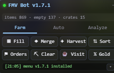

# farm-merge-bot

CDP-based automation for **Farm Merge Valley** running as a Discord Activity. Merges,
harvests, sorts, fills, handles orders and clears sources by calling the game's own
webpack modules directly over the Chrome DevTools Protocol — **no pixel automation, no
mouse/keyboard simulation**.

Version: 1.7.2 · Discord Activity build (served from `<app-id>.discordsays.com`)

> **Disclaimer**: unofficial fan project. Not affiliated with or endorsed by the
> game's developers or Discord. Automation may violate the game's terms of
> service — use at your own risk.



---

## Features

| Capability | Description |
|---|---|
| **Merge** | Direct merges via the game's own merge executor (3→1, 5→2+1 bonus math) |
| **Plan + Merge** | Plans all mergeable groups from one snapshot (natural 5/10/15 chains + move/swap grouping), executes in batched passes |
| **Sort** | Regroups movable items alphabetically (id, then tier), respecting the never-move rule |
| **Harvest** | Harvests ready crops/animals through the game's real `LootReceived` trigger, collects lootables and ground pickups |
| **Fill** | Spawns crates on every empty cell |
| **Orders** | Claims completed orders, starts every affordable order via the game's own orders service |
| **Auto Orders / Auto Clear** | Looping automation toggles (orders + source clearing with per-type Tree/Rock/Toolbox selection) |
| **Analysis popup** | Live session counters and item-sprite grid for everything the bot has done |
| **Background-tab protection** | The game keeps ticking while the tab is hidden (visibility fake + rAF bridge + Chrome background flags) |

## How it works

The game runs inside the Discord Activities iframe
(`https://<app-id>.discordsays.com/?instance_id=...`). All bot logic is injected
into the live frame via CDP `Runtime.evaluate` and talks to the game through its
own webpack modules — real entity behaviors, real services, real save paths.

The embedded build is **heavily obfuscated** (mangled runtime requires, string
literals and property names), so nothing is hardcoded: the poller captures every
webpack runtime require, and the hunter **re-discovers the game's internals
structurally at runtime** — root container, farm services, component map and the
MergeTrigger constructor — surviving game updates without changes.

### The merge pipeline (all client-side)

```
player drop → entity gains InteractionDropStart (+Dropable)
  → Drop System _performDrop → _performDropMerge
  → reads entity's MergeDetection behavior {cell, chain}
  → world.removeGameObject(draggedEntity)
  → targetCell.content.addBehavior(new MergeTrigger({cell: targetCell.position, chain}))
  → Merge executor auto-fires:
      count = chain.length + 1 → 3→1, 5→2+1 leftover (bonus merge math)
      destroys chain contents, spawns result, XP, sounds, onMerge event, saves
```

## Architecture

| File | Purpose |
|---|---|
| `src/cdp_lib.mjs` | CDP client over Node's built-in WebSocket; finds Chrome's debug port, attach + evaluate helpers, `findGameTarget()` (discordsays iframe) |
| `src/poller.js` | In-frame poller injected into the game frame; captures every webpack runtime require into `window.__FMV_rt`; carries the pause-protection patch |
| `src/hunter.js` | In-frame module hunter: picks the main runtime, re-discovers root container / farm services / component map / MergeTrigger ctor structurally |
| `src/fmv_helper.js` | `window.FMV` v4 API: `board` / `merge` / `move` / `swap` / `spawnCrate` / `remove` / `services` / `req` / `I` / `root` / `rootServices` |
| `src/util.js` | In-frame shared game-access helpers (`window.FMVUtil`): board reading, tap router, behavior registries, collectables |
| `src/plan.js` | Merge planner (5/10/15 chain grouping, move/swap ops) |
| `src/menu.js` | In-game FMV Bot overlay (draggable, top-right): Farm/Auto tabs, buttons, log panel; all bot logic runs in-frame |
| `src/install.mjs` | One-shot installer — poller → hunter → FMV → menu, evaluated live in the frame (no reload) |
| `src/eval.mjs` | One-off `Runtime.evaluate` of a JS expression in the game frame |
| `src/pause_protect.js` | Background-tab protection (visibility fake + rAF bridge with timer watchdog) |
| `auto-farm-install.bat` | Windows launcher: starts Chrome with the required flags and runs the installer |

## Requirements

- Chrome/Chromium with remote debugging (`--remote-debugging-port=9222`)
- Node.js ≥ 22 (built-in `WebSocket`)
- Discord with the **Farm Merge Valley** activity open (voice channel → Activities)

## Quick start

### Windows (recommended)

```powershell
.\auto-farm-install.bat
```

This starts Chrome with all required flags (debug port 9222, `IsolateSandboxedIframes`
so the sandboxed activity iframe gets its own CDP target, background-throttling
disables so the farm keeps running while hidden), waits for CDP, and runs the installer.

### Manual / other platforms

Start Chrome with:

```
chrome.exe --remote-debugging-port=9222 --enable-features=IsolateSandboxedIframes ^
    --disable-background-timer-throttling --disable-renderer-backgrounding ^
    --disable-backgrounding-occluded-windows --user-data-dir="<profile-dir>" https://discord.com/app
```

Open the Farm Merge Valley activity, wait for the farm to fully load, then:

```powershell
node src\install.mjs            # full install (poller → hunter → FMV → menu)
node src\install.mjs poller     # poller only (debug)
node src\install.mjs fmv        # hunter + FMV only (debug)
```

When it prints `DONE`, control everything from the **FMV Bot menu at the top-right
of the game window** — no node scripts needed for day-to-day use:

| Button | What it does |
|---|---|
| `Sort` | Regroups movable items into adjacent blocks in **alphabetical order (by id, then tier low→high)**. **Never-move rule (family-based):** no-id buildings, and families with no mergeable level (tree, rock, `area`/`premium` land, traintrack, delivery, decorative, blocker, toolbox) stay in place; families WITH mergeable levels are fully movable including their max-level items. Vault items (`coin`, `gem`, `energy`, `greenhouse`, `gazebo`) go to a solid block at the map's far corner. The same rule applies to Plan+Merge's moves/swaps |
| `Harvest` | Taps every READY harvestable item (animals + max-level crops) via the game's own click simulator, so loot, cooldowns, animations and saves are handled by the game. Skips items on cooldown and depleted ones; loot goes straight to the inventory |
| `Fill` | Spawns a crate on every empty cell until the map is full (crate contents ignored) |
| `Plan+Merge` | Plans ALL groups from one snapshot (natural 5/10/15 components + move/swap grouping), then executes them in one batched pass; repeats until no groups possible |
| `Orders` | Claims completed orders, then starts every affordable available order through the game's own `ordersService`; ingredients are deducted and the normal order timer/save path is used |
| `Auto Orders` | Toggle: claims completed orders and starts every affordable order every few seconds until stopped |
| `Auto Clear` | Toggle: clears `tree` / `rock` / `toolbox` sources (per-type selection) by driving the game's own payment + loot services — no click simulation, no popouts, camera-independent |
| `Analyze` | Live session statistics (merges, harvests, orders, energy spent, elapsed time, …) with an item-sprite grid |
| `Refresh` | Updates the `items · empty · crates` status line |

Click the header bar to collapse the menu; drag the header to move it. The log
panel shows every action. **Re-run `src/install.mjs` after any Chrome restart /
Discord activity restart / game reload** — the injection lives in the frame and
does not survive a reload.

### CLI usage (debugging / scripting)

Read the board:

```powershell
node src\eval.mjs "window.FMV.board().filter(i => i.mergeable)"
```

Each entry: `{col, row, id, tier, mergeable}`.

Fire a merge:

```powershell
node src\eval.mjs "window.FMV.merge(68, 68, 68, 69)"
```

Drops the item at (68,68) onto (68,69). Result `{ok: true, chainLen: n, total: n+1}`.

Merge rules enforced by the game itself (the helper mirrors them): both cells must
have content, the target must be `Mergeable`, the same-item chain (excluding the
dropped cell) must be ≥ 2 — two identical items do NOT merge.

Spawn a crate:

```powershell
node src\eval.mjs "window.FMV.spawnCrate(73, 70)"
```

## How discovery works (survives obfuscation)

| Target | Discovery |
|---|---|
| Main runtime | the captured require with the most executed modules in its store (stubbed enumeration — side-effect-free) |
| Root container | executed export subtree with a services collection (`.services` / `._nonCriticalServices`) holding timer, inventory (`getAmount`) and hudServiceRegistry |
| Farm services | first timer member's `_services` with `.mapGrid` (mapGrid, world, gridFilter, axonometricProjection, crateQueue, shovelService, interactionService, …) |
| Component map (`I`) | executed export with `.Mergeable` and `.GridPosition` keys — note it is a getter function: always `FMV.I().Mergeable` |
| MergeTrigger ctor | executed function export whose instance has `.cell` and `.chain` |
| Crate spawn event | `rootServices().hudServiceRegistry._activeService._commonEvents.spawnCrates` |

## Operational notes

- **Never navigate or reload the game frame.** The Discord activity restarts on
  reload (new `instance_id`) and the injection is lost. Always evaluate in the
  live frame, and keep heavy in-page work batched with event-loop breathing (the
  activity also restarts if the main thread stalls for seconds).
- Only one game session should be open (the target is matched by URL).
- Module ids change on game updates — the hunter re-discovers everything every
  run, no configuration needed.
- Run the installer only after the farm is fully loaded.
- The poller's fake chunk ids (`0x7ff00000 + n`) are safe: real chunk ids are
  small hex; id `0` is permanently consumed after one use — never reuse it.
- No game data, tokens or credentials are stored or sent anywhere — everything
  runs locally in your browser.

## Development

- Version is single-sourced: bump `VERSION` in `src/install.mjs` plus the
  changelog (see the checklist in `AGENTS.md`).
- No test framework — verification is live CDP runs against the game.
- Node-side tooling uses `.mjs` modules; in-frame injected sources are `.js`
  exported as `X_SOURCE` string constants.
